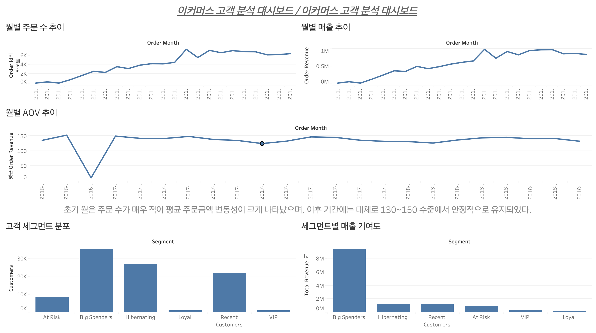

# Ecommerce Customer Analysis Project

<p align="center">
  <a href="#english-version">English Version</a> |
  <a href="#korean-version">한국어 버전</a>
</p>

---

<a name="english-version"></a>

# English Version

## 🚀 Project Title
Ecommerce Customer Analysis Project

## 📌 Project Overview
This project analyzes e-commerce transaction data to understand customer purchasing behavior, retention patterns, and revenue contribution by customer segment.

The main objective was to identify high-value customers, measure repeat purchase behavior, and derive actionable business insights that can support retention and customer strategy.

---

## 📂 Dataset
- **Dataset:** Brazilian E-Commerce Public Dataset by Olist
- **Main tables used:**
  - `orders`
  - `customers`
  - `order_items`

This project was built using both SQL and Python to validate analysis logic across tools and to organize the workflow into analysis, preprocessing, and export steps.

---

## 🛠 Tech Stack
- SQL
- PostgreSQL
- DBeaver
- Python
- pandas
- VS Code
- Tableau

---

## 🎯 Project Objectives
- Build an order-level summary table
- Analyze monthly order trends and Average Order Value (AOV)
- Calculate repeat customer ratio
- Perform RFM-based customer segmentation
- Measure revenue contribution by customer segment
- Evaluate whether retaining high-value customers is more effective than focusing only on new customer acquisition

---

## 📁 Project Structure
```text
ecommerce-data-analysis/
├─ data/
│  ├─ raw/
│  └─ processed/
├─ notebooks/
├─ scripts/
│  ├─ load_data.py
│  ├─ preprocess_data.py
│  └─ export_summary.py
├─ sql/
│  ├─ 01_raw_table_check.sql
│  ├─ 02_order_summary.sql
│  ├─ 03_monthly_orders_aov.sql
│  ├─ 04_customer_summary.sql
│  ├─ 05_rfm_base.sql
│  ├─ 06_rfm_segment.sql
│  └─ 07_segment_revenue.sql
└─ README.md
```

## 🔎 Analysis Process
### 1. Raw Data Validation
First, the raw tables were checked to validate row counts, key structures, and join relationships.

#### Key findings
- orders is an order-level table
- customers includes both customer_id and customer_unique_id
- order_items contains multiple rows per order because one order can include multiple products

### 2. Order Summary Construction
#### A delivered-order-only summary table was created by joining:
- orders
- customers
- order_items

#### The summary table included:
- order_id
- customer_unique_id
- order_purchase_timestamp
- items_count
- order_revenue
- freight_total

### 3. Customer-Level Aggregation

#### Order-level data was then aggregated to customer level in order to measure:
- first purchase date
- last purchase date
- total orders
- total revenue
- total freight

### 4. RFM Segmentation

#### Customers were segmented using:
- Recency
- Frequency
- Monetary

#### Segments created:
- VIP
- Loyal
- Big Spenders
- Recent Customers
- At Risk
- Hibernating

### 5. Revenue Contribution Analysis

#### The final step compared:
- customer share by segment
- revenue share by segment
- revenue efficiency by segment

## 📊 Key Findings
- Only **3.0%** of customers were repeat customers, indicating a very high drop-off after the first purchase.
- The **Big Spenders** segment represented **37.71%** of customers but contributed **71.22%** of total revenue.
- The **VIP** segment accounted for only **1.00%** of customers, but showed the highest revenue efficiency at **2.31**.
- **Recent Customers** and **Hibernating** segments had relatively low revenue efficiency, suggesting the need for conversion and reactivation strategies.
- Overall, the analysis suggests that retaining high-value customers and converting one-time buyers into repeat customers may be more impactful than focusing only on new customer acquisition.

### Cohort Analysis Insight
Cohort retention analysis shows that most customers dropped off quickly after their first purchase.  
Retention declined sharply from the second month onward, and remained low in later periods.  
This suggests that improving repeat purchase conversion and strengthening retention strategies may be more important than focusing only on new customer acquisition.

---

## 🧮 SQL Analysis
SQL was used to:
- validate raw table structure
- build `order_summary_view`
- calculate monthly order trends and AOV
- calculate customer summary and repeat customer ratio
- create RFM metrics
- generate customer segments
- analyze segment-level revenue contribution

---

## 🐍 Python Preprocessing
Python scripts were used to:
- load raw CSV files
- convert datetime columns
- filter delivered orders
- merge tables into a base dataframe
- create `order_summary` and `customer_summary`
- export processed CSV files

---

## 📦 Output Files
Generated processed files:
- `data/processed/order_summary.csv`
- `data/processed/customer_summary.csv`

---

## 📈 Dashboard Plan
Planned Tableau dashboard sections:
- Monthly orders and revenue trend
- Average Order Value (AOV) trend
- Customer segment distribution
- Revenue contribution by segment
- Retention / cohort summary

## 📷 Dashboard Preview

### Dashboard Overview



---

## 💡 Business Implication
This project shows that revenue is concentrated in a limited number of high-value customer groups.

Therefore, improving retention, encouraging second purchases, and maintaining high-value customers are likely to be more effective than relying only on new customer acquisition.

<a name="korean-version"></a>

# 한국어 버전

## 🚀 프로젝트명
이커머스 고객 분석 프로젝트

## 📌 프로젝트 개요
본 프로젝트는 이커머스 거래 데이터를 활용하여 고객 구매 행동, 리텐션 패턴, 그리고 고객 세그먼트별 매출 기여도를 분석한 프로젝트입니다.

주요 목표는 고가치 고객을 식별하고, 재구매 행동을 측정하며, 고객 유지 전략에 활용할 수 있는 비즈니스 인사이트를 도출하는 것이었습니다.

---

## 📂 데이터셋
- **사용 데이터셋:** Brazilian E-Commerce Public Dataset by Olist
- **주요 사용 테이블:**
  - `orders`
  - `customers`
  - `order_items`

본 프로젝트는 SQL과 Python을 함께 활용하여 분석 로직을 검증하고, 전처리와 집계 과정을 분리하여 정리했습니다.

---

## 🛠 사용 기술
- SQL
- PostgreSQL
- DBeaver
- Python
- pandas
- VS Code
- Tableau

---

## 🎯 프로젝트 목표
- 주문 단위 summary 테이블 생성
- 월별 주문 추이 및 평균 주문 금액(AOV) 분석
- 재구매 고객 비율 계산
- RFM 기반 고객 세그먼트 분석
- 고객 세그먼트별 매출 기여도 분석
- 신규 고객 확보보다 고가치 고객 유지가 더 중요한지 검토

---

## 📁 프로젝트 구조
```text
ecommerce-data-analysis/
├─ data/
│  ├─ raw/
│  └─ processed/
├─ notebooks/
├─ scripts/
│  ├─ load_data.py
│  ├─ preprocess_data.py
│  └─ export_summary.py
├─ sql/
│  ├─ 01_raw_table_check.sql
│  ├─ 02_order_summary.sql
│  ├─ 03_monthly_orders_aov.sql
│  ├─ 04_customer_summary.sql
│  ├─ 05_rfm_base.sql
│  ├─ 06_rfm_segment.sql
│  └─ 07_segment_revenue.sql
└─ README.md
```

## 🔎 분석 과정

### 1. Raw 데이터 검증
먼저 raw 테이블의 row 수, key 구조, join 관계를 확인했습니다.

#### 주요 확인 내용
- `orders`는 주문 단위 테이블
- `customers`에는 `customer_id`와 `customer_unique_id`가 함께 존재
- `order_items`는 한 주문에 여러 상품이 있을 수 있어 주문 ID가 반복됨

---

### 2. 주문 단위 Summary 테이블 생성
배송 완료(`delivered`) 주문만 대상으로 다음 테이블을 조인했습니다.

- `orders`
- `customers`
- `order_items`

이 과정을 통해 다음 컬럼을 포함한 주문 단위 summary를 생성했습니다.

- `order_id`
- `customer_unique_id`
- `order_purchase_timestamp`
- `items_count`
- `order_revenue`
- `freight_total`

---

### 3. 고객 단위 집계
주문 단위 데이터를 고객 단위로 집계하여 다음 지표를 계산했습니다.

- 첫 구매일
- 마지막 구매일
- 총 주문 수
- 총 매출
- 총 배송비

---

### 4. RFM 세그먼트 분석
고객을 다음 기준으로 분류했습니다.

- **Recency**
- **Frequency**
- **Monetary**

생성한 세그먼트:

- VIP
- Loyal
- Big Spenders
- Recent Customers
- At Risk
- Hibernating

---

### 5. 세그먼트별 매출 기여도 분석
마지막으로 세그먼트별로 다음 지표를 비교했습니다.

- 고객 비중
- 매출 비중
- 매출 효율

---

## 📊 핵심 인사이트
- 전체 고객 중 재구매 고객 비율은 **3.0%**로, 첫 구매 이후 이탈이 매우 큰 구조를 확인할 수 있었습니다.
- **Big Spenders** 세그먼트는 전체 고객의 **37.71%**를 차지했지만, 전체 매출의 **71.22%**를 기여한 핵심 매출 집단이었습니다.
- **VIP** 세그먼트는 고객 비중은 **1.00%**에 불과했지만, 매출 효율은 **2.31**로 가장 높게 나타났습니다.
- **Recent Customers**와 **Hibernating** 세그먼트는 고객 수 대비 매출 효율이 낮아, 재구매 전환 및 재활성화 전략이 필요하다는 점을 확인했습니다.
- 전반적으로 신규 고객 유입 확대보다, 고가치 고객 유지와 1회 구매 고객의 재구매 전환이 더 중요한 과제로 해석할 수 있었습니다.

### 코호트 분석 인사이트
코호트 리텐션 분석 결과, 대부분의 고객은 첫 구매 이후 빠르게 이탈하는 패턴을 보였습니다.  
특히 2개월차 리텐션이 크게 낮아지며, 이후 월에서도 유지율이 높지 않았습니다.  
따라서 이커머스 성과 개선을 위해서는 신규 고객 유입 확대뿐 아니라, 첫 구매 고객을 재구매 고객으로 전환시키는 CRM 및 프로모션 전략이 중요하다고 해석할 수 있습니다.

---

## 🧮 SQL 분석
SQL을 활용하여 다음 작업을 수행했습니다.

- raw 테이블 구조 검증
- `order_summary_view` 생성
- 월별 주문 추이 및 AOV 계산
- 고객 summary 및 재구매 비율 계산
- RFM 지표 생성
- 고객 세그먼트 분류
- 세그먼트별 매출 기여도 분석

---

## 🐍 Python 전처리
Python 스크립트를 활용하여 다음 작업을 수행했습니다.

- raw CSV 파일 로드
- 날짜형 컬럼 변환
- delivered 주문 필터링
- 테이블 병합 및 base dataframe 생성
- `order_summary`, `customer_summary` 생성
- processed CSV 파일 저장

---

## 📦 생성 결과물
생성된 processed 파일:

- `data/processed/order_summary.csv`
- `data/processed/customer_summary.csv`

---

## 📈 대시보드 구성 계획
Tableau 대시보드 구성 예정 항목:

- 월별 주문 수 및 매출 추이
- 평균 주문 금액(AOV) 추이
- 고객 세그먼트 분포
- 세그먼트별 매출 기여도
- 리텐션 / 코호트 요약

## 📷 Dashboard Preview

### Dashboard Overview


---

## 💡 비즈니스 시사점
본 프로젝트를 통해 매출이 일부 고가치 고객군에 집중되어 있음을 확인할 수 있었습니다.

따라서 신규 고객 확보만 확대하기보다, 고가치 고객 유지와 첫 구매 고객의 재구매 전환 전략이 더 효과적일 가능성이 높다고 해석할 수 있습니다.